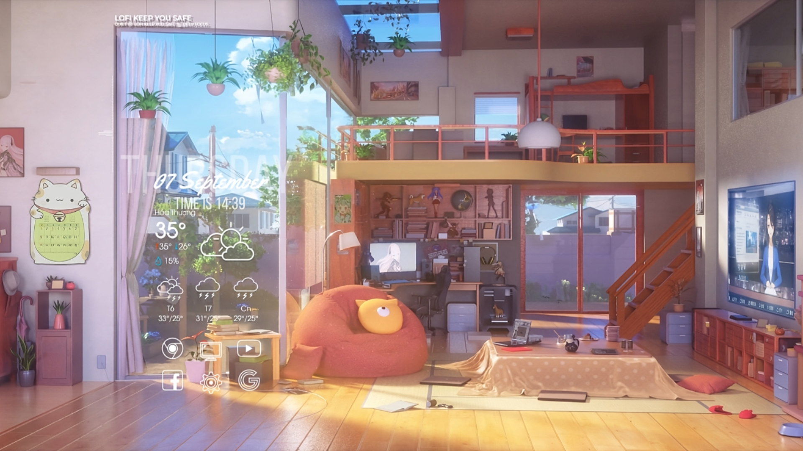
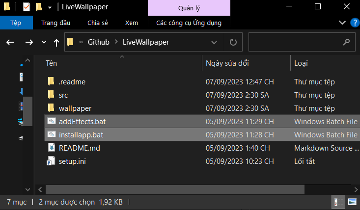
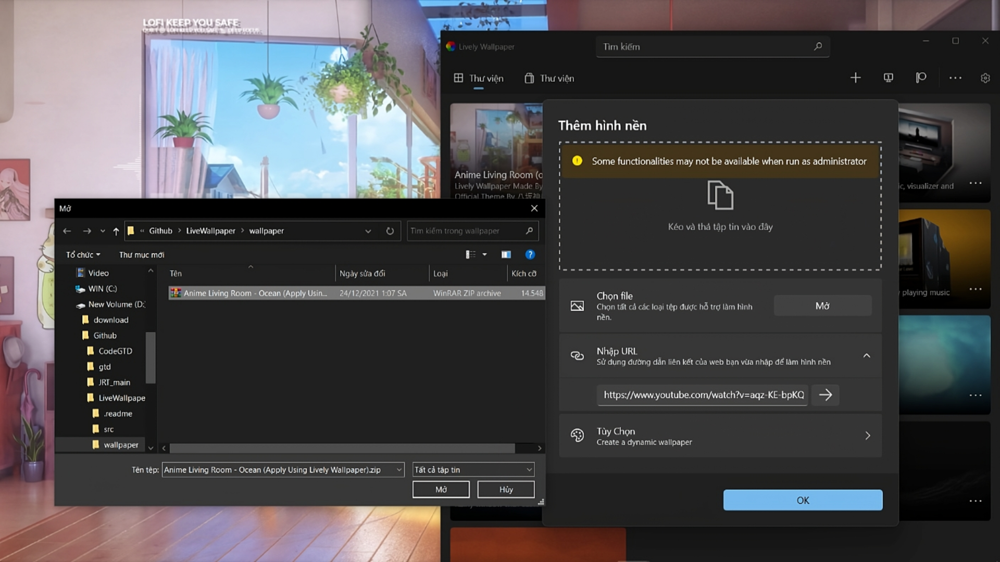
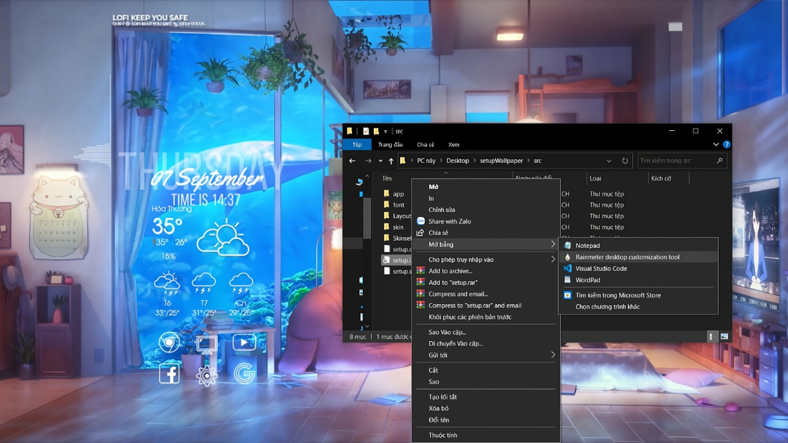

# VUI LÒNG ĐỌC KĨ TRƯỚC KHI SỬ DỤNG HOẶC XEM VIDEO TRÊN YOUTUBE//PLEASE READ CAREFULLY BEFORE USING OR WATCH THE VIDEO ON YOUTUBE

<h1 align="center">
    
</h1>

 
 

 
 

# PREVIEW

# VIETNAMESE

## VUI LÒNG ĐỌC KĨ TRƯỚC KHI SỬ DỤNG HOẶC XEM VIDEO TRÊN YOUTUBE  

### Cách cài dặt tài nguyên:

#### Chạy file theo thứ tự sau

~installapp.bat
 
~addEffects.bat
 
Chạy lần lượt các file trên roài enter thoii, nhớ tải cả apps trên web nhe

### Cách setup:
<b>Mở app lively wallpaper, cài dặt hình nền trong file wallpaper.</b>

<b> Mở file setup.ini bằng rainmeter. </b> 

Vậy là xong rùi!! Không hiểu thì xem video nha

# ENGLISH

## PLEASE READ CAREFULLY BEFORE USING OR WATCHING VIDEOS ON YOUTUBE  

### How to install resources:

#### Run the files in the following order

~installapp.bat
 
~addEffects.bat
 
Run the above files one by one and then enter, remember to download the apps on the web as well

### How to setup:
<b>Open the lively wallpaper app, set the wallpaper in the wallpaper file.</b>

<b> Open the setup.ini file with rainmeter. </b>

That's it!! If you don't understand, watch the video
